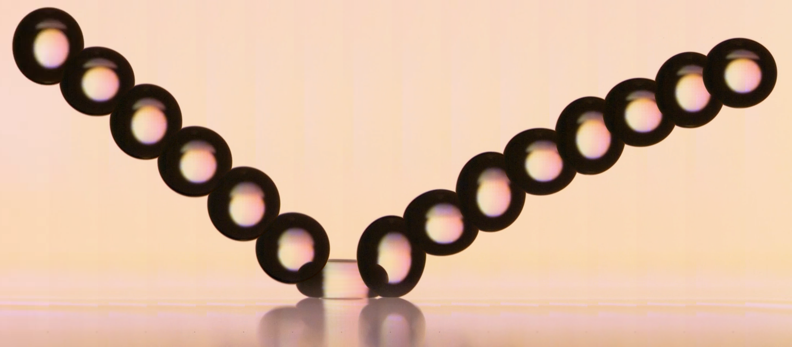

# Drop rebound at low Weber number

This repository provides MATLAB scripts for simulating the dynamics of liquid droplets impacting solid substrates. The code systematically explores droplet deformation, spreading, rebound behaviors, and other key physical phenomena, capturing detailed dynamics through numerical simulations.



<div style="text-align:center">
  <br/>
  <em>A typical example of drop generation. A liquid jet is ejected from a circular orifice when a 
piezoelectric diaphragm is flexed. As the diaphragm relaxes, the stream is retracted while capillary
forces pinch off a drop. The upward motion of the stream during pinch-off directs the drop 
upward, allowing oscillations of the drop’s interface to decay before it descends. The video is 
played at 3/1600x real speed</em>
</div>


---

## Overview

The project models the complex behavior of liquid droplets when they impact solid surfaces, capturing phenomena like maximum spreading, bounce optimization, energy transfer, and shape deformation using a numerical approach based on spherical harmonics and Newton-Raphson methods. It includes simulation sweeps for parameter exploration such as Weber number (`We`), Bond number (`Bo`), and Ohnesorge number (`Oh`).

<table align="center">
  <tr>
    <td align="center">
      <figure>
         <br/>
        <em>The upper We limits of full drop rebound on a viscous film. For a low Oh drop (Oh = 0.02, We = 
5.4, Bo = 0.22), a droplet is ejected from the drop during rebound for sufficiently high We. At 
higher We, and irrespective of Oh, the air layer between the rebounding drop and viscous film 
breaks down and a small sessile drop is deposited (Oh = 0.02, We = 9.1, Bo = 0.22). The video is 
played at 1/300x real speed. </em>
      </figure>    
    </td>
     <td align="center">
      <figure>
         <br/>
        <em> Drops of increasing viscosity rebounding from a rigid, oil-coated glass slide. From left to right, the 
dimensionless parameters are Oh = 0.03, Bo = 0.02, We = 0.25; Oh = 0.29, Bo = 0.02, We = 0.3; 
and Oh = 0.71, Bo = 0.02, We = 0.27. The video is played at 3/1600x real speed. </em>
      </figure>    
    </td>
  </tr>
  <tr>
    <td align="center">
      <figure>
         <br/>
        <figcaption>Comparison between experiment and the drop shape predicted by our reduced-order model (solid, 
blue) and direct numerical simulation (dashed, blue) for We = 0.253, Bo = 0.02, and Oh = 0.03. </figcaption>
      </figure>    
    </td>
    <td align="center">
      <figure>
         <br/>
        <figcaption>Comparison between experiment and the drop shape predicted by our reduced-order model (solid, 
blue) and direct numerical simulation (dashed, blue) for We = 0.023, Bo = 0.02, and Oh = 0.03.</figcaption>
      </figure>    
    </td>
  </tr>
</table>

<table align="center">
  <tr>
    <td align="center">
      <figure>
         <br/>
        <em>Drops of similar size Bo = 0.02 and liquid properties Oh = 0.03 rebounding from a rigid, oil-
coated glass slide for We = 0.006, 0.023, 0.253, and 2.269, from left to right. The video is played 
at 3/1600x real speed. </em>
      </figure>    
    </td>
    <td align="center">
      <figure>
         <br/>
        <figcaption>Comparison of a small drop Bo = 0.006 (We = 0.13, Oh = 0.04) and large drop Bo = 0.075 (We 
= 0.17, Oh = 0.02) of the same fluid rebounding at similar We. The video is played at 1/300x real
speed.</figcaption>
      </figure>    
    </td>
  </tr>
</table>

---

# MATLAB Code


MATLAB R2020 or newer recommended (Parallel Computing Toolbox required). A python version of this solver is available at [this repo](https://github.com/Katiekuehr/Drop_Simulations)


## File Structure

```
project/
│
├── 1_code/
│   ├── sweeper_experiments.m
│   ├── simulation_code/
│   │   ├── function_to_minimize_v1.m
│   │   ├── maximum_contact_radius.m
│   │   ├── r_from_spherical.m
│   │   └── ...
│   └── postprocessing.m
├── 2_output/
│   ├── Logger/
│   └── (simulation results stored here)
└── 0_data/
    └── (processed data and logs)
```

---

## Running Simulations

You can run simulations in bulk or one by one
### Running in bulk:


In `sweeper_experiments.m`, set parameters like:
- Surface tension (`sigma`)
- Droplet density (`rho`)
- Initial radius (`Ro`)
- Weber (`We`) and Bond (`Bo`) numbers

Then, run the script. It should run them in parallel by default.

### Runnning only one simulation

The script `simulation_code/solve_motion_v2` can run single simulations. 

### Postprocessing simulations

Once simulations are completed, execute post-processing scripts to analyze simulation outcomes:

```matlab
postprocessing
```

This script computes metrics such as maximum droplet width, restitution coefficients, and contact times.

### Generate Animations (Optional):

   Create animations from the simulation data:

   ```matlab
   export_animation
   ```

---


---

## Cite Me

If you use this software or refer to the methodologies in your academic or professional work, please cite our associated paper as follows:

```bibtex
@misc{gabbard2025dropreboundlowweber,
      title={Drop rebound at low Weber number}, 
      author={Chase T. Gabbard and Elvis A. Aguero and Radu Cimpeanu and Katharina Kuehr and Eli Silver and Jack-William Barotta and Carlos A. Galeano-Rios and Daniel M. Harris},
      year={2025},
      eprint={2505.00902},
      archivePrefix={arXiv},
      primaryClass={physics.flu-dyn},
      url={https://arxiv.org/abs/2505.00902}, 
}
```

---

## License

This software is provided under the [MIT License](LICENSE). See the `LICENSE` file for more details.
